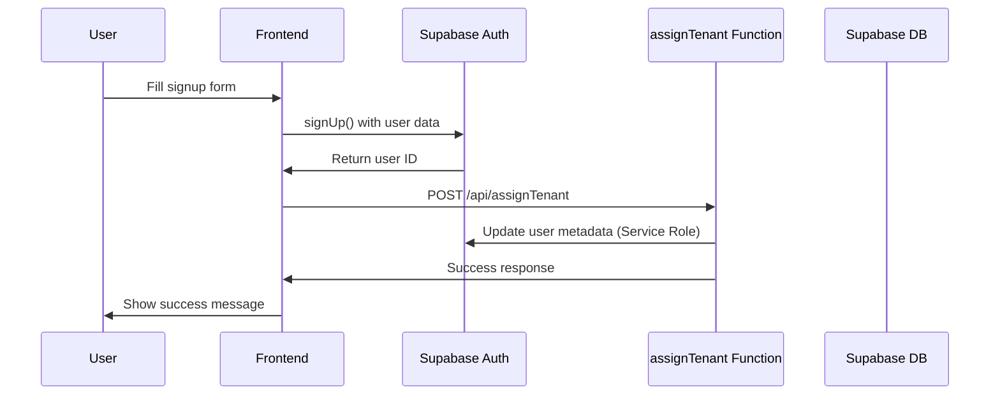
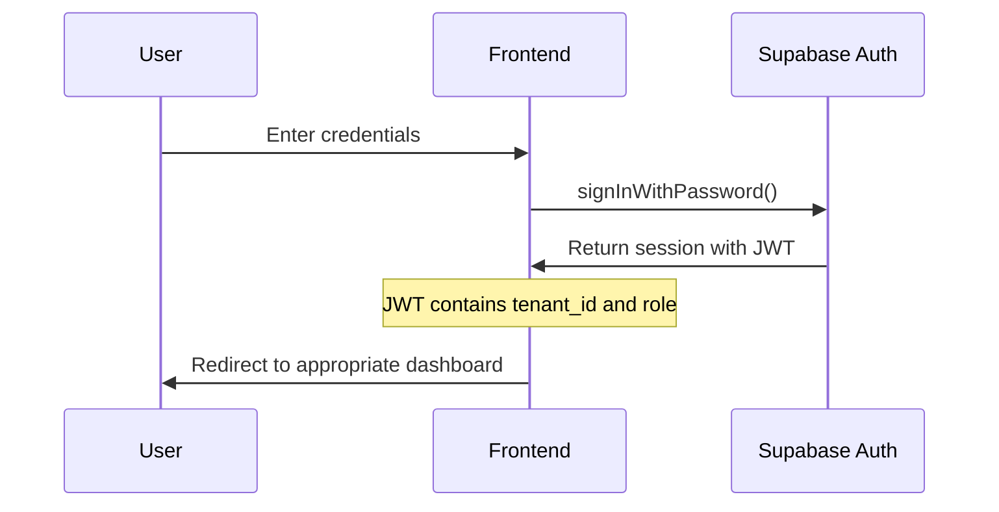
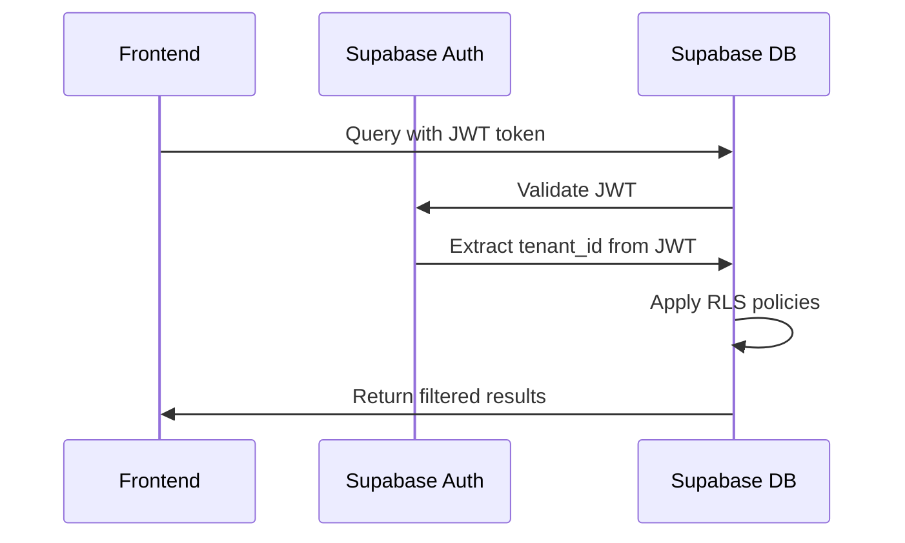

# Authentication Setup Guide

This document describes the multi-tenant authentication system implemented with Supabase.

## Overview

The authentication system provides:
- User signup/login with Supabase Auth
- Automatic tenant (school) assignment via serverless function
- Role-based access control
- Multi-tenant data isolation
- JWT tokens containing tenant_id and role

## Environment Variables

### Required for All Environments

```bash
# Supabase Configuration
SUPABASE_URL=https://your-project.supabase.co
SUPABASE_ANON_KEY=your-anon-key-here

# For serverless functions only (NEVER expose in frontend)
SUPABASE_SERVICE_ROLE_KEY=your-service-role-key-here
ASSIGN_TENANT_SECRET=your-secret-token-here
```

### Local Development (.env.local)

```bash
# Frontend variables (safe to expose)
VITE_SUPABASE_URL=https://your-project.supabase.co
VITE_SUPABASE_ANON_KEY=your-anon-key-here

# Backend/API variables (keep secure)
SUPABASE_SERVICE_ROLE_KEY=your-service-role-key-here
ASSIGN_TENANT_SECRET=dev-secret-key-change-in-production
```

### Production Environment Variables

Set these in your deployment platform (Vercel, Netlify, etc.):

```bash
SUPABASE_URL=https://your-project.supabase.co
SUPABASE_ANON_KEY=your-anon-key
SUPABASE_SERVICE_ROLE_KEY=your-service-role-key
ASSIGN_TENANT_SECRET=secure-random-string-for-production
```

## Local Development Setup

### 1. Install Dependencies

```bash
npm install
```

### 2. Configure Environment

Create `.env.local` with the variables listed above.

### 3. Run Frontend

```bash
npm run dev
```

### 4. Run Serverless Functions Locally

#### For Vercel:
```bash
npm install -g vercel
vercel dev
```

#### For local Express server (alternative):
Create `server.js`:
```javascript
const express = require('express');
const assignTenant = require('./api/assignTenant');
const app = express();

app.use(express.json());
app.post('/api/assignTenant', assignTenant);

app.listen(3001, () => {
  console.log('API server running on http://localhost:3001');
});
```

Run with: `node server.js`

### 5. Test Authentication Flow

1. Go to `http://localhost:3000`
2. Click "Create New Account"
3. Fill out the signup form with a school and role
4. Check browser console for JWT verification logs
5. After login, verify tenant_id and role are present

## How It Works

### 1. Signup Flow



### 2. Login Flow



### 3. Data Access with RLS



## Security Features

### 1. Service Role Key Protection

- ✅ Service role key used only in serverless functions
- ✅ Never exposed in frontend code or repository
- ✅ Protected by secret header authentication
- ✅ Request logging and validation

### 2. Multi-tenant Isolation

- ✅ tenant_id in JWT automatically filters data
- ✅ RLS policies enforce data isolation
- ✅ No cross-tenant data access possible

### 3. Role-based Access Control

- ✅ User roles stored in JWT metadata
- ✅ RLS policies respect role permissions
- ✅ Frontend routes protected by role

## Testing and Verification

### Manual Test Checklist

1. **Signup Test**
   - [ ] Create new account with school and role selection
   - [ ] Verify assignTenant API is called (check Network tab)
   - [ ] Confirm user created in Supabase Auth dashboard
   - [ ] Check user metadata contains tenant_id and role

2. **Login Test**
   - [ ] Login with created account
   - [ ] Open browser console
   - [ ] Verify logs show "✅ JWT contains tenant_id and role"
   - [ ] Check session data in Application > Storage > Local Storage

3. **RLS Test**
   - [ ] Login as user from one school
   - [ ] Query student/teacher data
   - [ ] Verify only data from that school is returned
   - [ ] No data from other schools visible

### Automated Test Script

Create `test-auth.js`:

```javascript
const { createClient } = require('@supabase/supabase-js');

async function testAuth() {
  const supabase = createClient(
    process.env.SUPABASE_URL,
    process.env.SUPABASE_ANON_KEY
  );

  // Test signup
  const testEmail = `test-${Date.now()}@example.com`;
  const { data: signUpData, error: signUpError } = await supabase.auth.signUp({
    email: testEmail,
    password: 'test123456',
    options: {
      data: {
        first_name: 'Test',
        last_name: 'User',
        role: 'student'
      }
    }
  });

  if (signUpError) {
    console.error('Signup failed:', signUpError);
    return;
  }

  console.log('✅ Signup successful:', signUpData.user.id);

  // Test assignTenant
  const response = await fetch('http://localhost:3001/api/assignTenant', {
    method: 'POST',
    headers: {
      'Content-Type': 'application/json',
      'x-assign-tenant-secret': process.env.ASSIGN_TENANT_SECRET
    },
    body: JSON.stringify({
      userId: signUpData.user.id,
      tenantId: 'your-test-school-id',
      role: 'student'
    })
  });

  const result = await response.json();
  console.log('✅ Tenant assignment:', result);
}

testAuth().catch(console.error);
```

Run with: `node test-auth.js`

## Key Rotation

### Rotating Service Role Key

1. **Generate New Key**
   - Go to Supabase Dashboard > Settings > API
   - Generate new service role key

2. **Update Environment Variables**
   - Update `SUPABASE_SERVICE_ROLE_KEY` in all environments
   - Deploy changes

3. **Revoke Old Key**
   - Delete old service role key from Supabase dashboard

### Rotating Assign Tenant Secret

1. **Generate New Secret**
   ```bash
   openssl rand -hex 32
   ```

2. **Update Environment Variables**
   - Update `ASSIGN_TENANT_SECRET` in all environments
   - Update secret in frontend SignUpForm.tsx (for production, make this configurable)

3. **Deploy Changes**

## Troubleshooting

### Common Issues

1. **"Server configuration error"**
   - Check all environment variables are set
   - Verify service role key is correct

2. **"Unauthorized" on assignTenant**
   - Check `ASSIGN_TENANT_SECRET` matches in both environments
   - Verify secret header is being sent

3. **"JWT missing tenant_id or role"**
   - Check assignTenant function was called successfully
   - Verify user metadata was updated in Supabase Auth dashboard

4. **RLS blocking legitimate queries**
   - Check user has tenant_id in metadata
   - Verify RLS policies match your tenant structure

### Debug Commands

```bash
# Check if serverless function is running
curl -X POST http://localhost:3001/api/assignTenant \
  -H "Content-Type: application/json" \
  -H "x-assign-tenant-secret: your-secret" \
  -d '{"userId":"test","tenantId":"test","role":"test"}'

# Check Supabase connection
node -e "console.log(process.env.SUPABASE_URL)"
```

## Deployment

### GitHub Actions Example

```yaml
name: Deploy

on:
  push:
    branches: [main]

jobs:
  deploy:
    runs-on: ubuntu-latest
    steps:
      - uses: actions/checkout@v2
      
      - name: Deploy to Vercel
        uses: amondnet/vercel-action@v20
        with:
          vercel-token: ${{ secrets.VERCEL_TOKEN }}
          vercel-org-id: ${{ secrets.ORG_ID }}
          vercel-project-id: ${{ secrets.PROJECT_ID }}
        env:
          SUPABASE_URL: ${{ secrets.SUPABASE_URL }}
          SUPABASE_ANON_KEY: ${{ secrets.SUPABASE_ANON_KEY }}
          SUPABASE_SERVICE_ROLE_KEY: ${{ secrets.SUPABASE_SERVICE_ROLE_KEY }}
          ASSIGN_TENANT_SECRET: ${{ secrets.ASSIGN_TENANT_SECRET }}
```

## Multi-tenant Considerations

### Current Design: Single Tenant Per User

- Each user belongs to exactly one school (tenant)
- tenant_id stored in user metadata
- Simple and secure

### Future: Multiple Tenants Per User

If users need access to multiple schools:

1. **Change user metadata structure:**
   ```json
   {
     "tenants": [
       {"tenant_id": "school-1", "role": "teacher"},
       {"tenant_id": "school-2", "role": "admin"}
     ],
     "active_tenant": "school-1"
   }
   ```

2. **Update RLS policies** to check array membership
3. **Add tenant switching** in frontend UI
4. **Modify assignTenant function** to handle multiple tenants

## Migration Log

- **2025-01-20**: Initial auth system implementation
- **2025-01-20**: Added assignTenant serverless function
- **2025-01-20**: Created subscriptions table for future billing
- **2025-01-20**: Implemented signup/login flows with tenant assignment