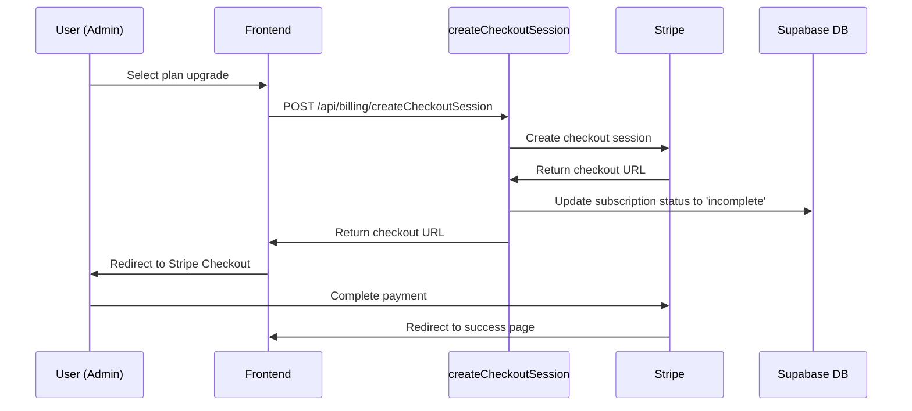
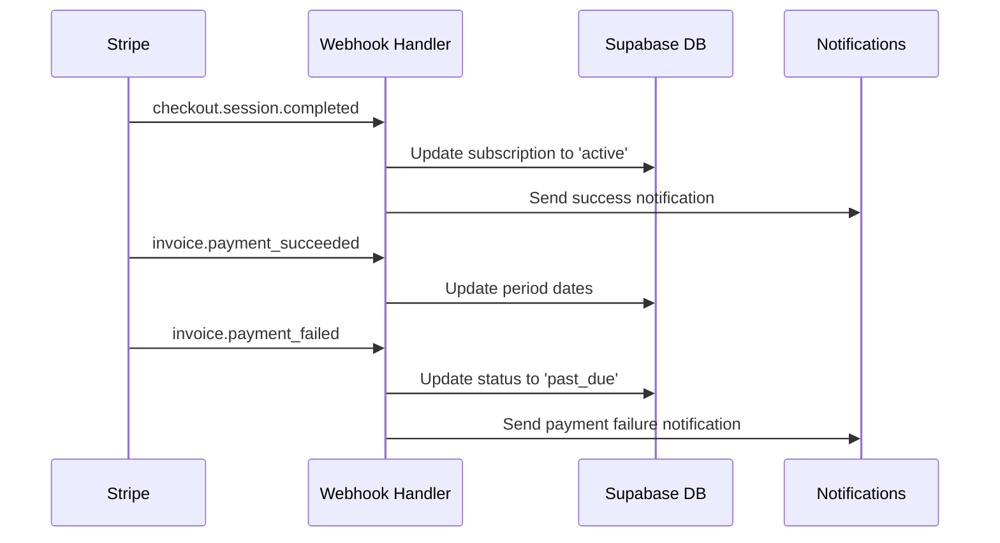

# Billing Integration Plan (Stripe Skeleton)

This document outlines the Stripe billing integration that is prepared but not yet activated.

## Current Status: SKELETON ONLY

⚠️ **Important**: Billing is NOT active. Only skeleton endpoints and database structure are in place.

## Architecture Overview

### Database Schema

The `subscriptions` table is ready for Stripe integration:

```sql
TABLE: subscriptions
- id (UUID, Primary Key)
- school_id (UUID, FK to schools.id) 
- stripe_subscription_id (TEXT, NULL) -- Populated when Stripe is active
- plan (TEXT) -- free, basic, premium, enterprise  
- status (TEXT) -- active, canceled, past_due, incomplete
- current_period_start (TIMESTAMPTZ)
- current_period_end (TIMESTAMPTZ)
- trial_start (TIMESTAMPTZ)
- trial_end (TIMESTAMPTZ)
- created_at, updated_at (TIMESTAMPTZ)
- tenant_id (UUID) -- For RLS isolation
```

### Planned Subscription Plans

| Plan | Price | Features |
|------|-------|----------|
| Free | $0/month | Up to 50 students, Basic features |
| Basic | $29/month | Up to 200 students, Standard features |
| Premium | $79/month | Up to 1000 students, Advanced features |
| Enterprise | $199/month | Unlimited students, All features |

## Stripe Integration Flow

### 1. Product/Price Setup in Stripe

When billing is activated, create these in Stripe Dashboard:

```javascript
// Stripe Products and Prices to create:
const plans = [
  {
    product: "School ERP Basic",
    price_id: "price_basic_monthly", // Replace with actual Stripe price ID
    amount: 2900, // $29.00 in cents
    interval: "month"
  },
  {
    product: "School ERP Premium", 
    price_id: "price_premium_monthly",
    amount: 7900, // $79.00 in cents
    interval: "month"
  },
  {
    product: "School ERP Enterprise",
    price_id: "price_enterprise_monthly", 
    amount: 19900, // $199.00 in cents
    interval: "month"
  }
];
```

### 2. Checkout Flow



### 3. Webhook Processing



## Required Stripe Configuration

### Environment Variables

```bash
# Production Stripe Keys
STRIPE_PUBLISHABLE_KEY=pk_live_...
STRIPE_SECRET_KEY=sk_live_...
STRIPE_WEBHOOK_SECRET=whsec_...

# Test/Development Keys  
STRIPE_PUBLISHABLE_KEY=pk_test_...
STRIPE_SECRET_KEY=sk_test_...
STRIPE_WEBHOOK_SECRET=whsec_...
```

### Webhook Endpoints

Configure these endpoints in Stripe Dashboard:

- **Endpoint URL**: `https://your-domain.com/api/billing/webhook`
- **Events to listen for**:
  - `checkout.session.completed`
  - `invoice.payment_succeeded` 
  - `invoice.payment_failed`
  - `customer.subscription.updated`
  - `customer.subscription.deleted`

## Implementation Steps

### Phase 1: Stripe Account Setup

1. **Create Stripe Account**
   - Sign up at https://stripe.com
   - Complete business verification
   - Enable billing products

2. **Create Products and Prices**
   - Go to Stripe Dashboard > Products
   - Create products for each plan
   - Set up monthly recurring prices
   - Note down price IDs

3. **Configure Webhooks**
   - Go to Stripe Dashboard > Webhooks
   - Add endpoint: `/api/billing/webhook`
   - Select required events
   - Copy webhook secret

### Phase 2: Code Activation

1. **Update Environment Variables**
   ```bash
   # Add to your deployment environment
   STRIPE_SECRET_KEY=sk_live_... # or sk_test_...
   STRIPE_WEBHOOK_SECRET=whsec_...
   ```

2. **Activate Endpoints**
   - Remove skeleton comments from `/api/billing/createCheckoutSession.js`
   - Remove skeleton comments from `/api/billing/webhook.js`
   - Install Stripe npm package: `npm install stripe`

3. **Update Frontend**
   - Add billing UI components
   - Integrate checkout session creation
   - Add subscription management page

### Phase 3: Testing

1. **Use Stripe Test Mode**
   - Use test API keys
   - Test with test credit cards
   - Verify webhook delivery

2. **Test Scenarios**
   - Successful subscription creation
   - Failed payment handling
   - Subscription cancellation
   - Plan upgrades/downgrades

### Phase 4: Go Live

1. **Switch to Live Keys**
   - Update environment variables
   - Test in production with small amount

2. **Monitor**
   - Set up Stripe Dashboard monitoring
   - Configure billing alerts
   - Monitor webhook delivery

## Feature Flags by Plan

When billing is active, implement these restrictions:

```javascript
const planLimits = {
  free: {
    maxStudents: 50,
    features: ['basic_reports', 'student_management']
  },
  basic: {
    maxStudents: 200, 
    features: ['basic_reports', 'student_management', 'grade_tracking']
  },
  premium: {
    maxStudents: 1000,
    features: ['basic_reports', 'student_management', 'grade_tracking', 'advanced_analytics', 'bulk_operations']
  },
  enterprise: {
    maxStudents: Infinity,
    features: ['all_features']
  }
};

// Usage in components:
const { subscription } = useSubscription();
const canUseFeature = (feature) => {
  return planLimits[subscription.plan]?.features.includes(feature);
};
```

## Database Queries for Billing

### Check School's Subscription Status

```sql
SELECT s.*, sch.name as school_name
FROM subscriptions s
JOIN schools sch ON sch.id = s.school_id  
WHERE s.school_id = $1;
```

### Get Schools Needing Payment Retry

```sql
SELECT s.*, sch.name as school_name, sch.email
FROM subscriptions s
JOIN schools sch ON sch.id = s.school_id
WHERE s.status = 'past_due' 
  AND s.updated_at < NOW() - INTERVAL '7 days';
```

### Usage Analytics for Billing

```sql
-- Student count by school (for plan limit enforcement)
SELECT 
  p.school_id,
  COUNT(*) as student_count,
  s.plan,
  s.status
FROM profiles p
JOIN subscriptions s ON s.school_id = p.school_id
WHERE p.role = 'student' AND p.is_active = true
GROUP BY p.school_id, s.plan, s.status;
```

## Error Handling

### Payment Failures

1. **Immediate Actions**
   - Update subscription status to 'past_due'
   - Send email notification to school admin
   - Show billing banner in UI

2. **Grace Period** (7 days)
   - Continue service with warnings
   - Daily reminder emails
   - UI notifications

3. **Service Suspension** (after 7 days)
   - Disable write operations
   - Show "payment required" screens
   - Preserve data in read-only mode

### Webhook Failures

1. **Retry Logic**
   - Stripe automatically retries failed webhooks
   - Implement idempotency in webhook handler
   - Log all webhook events for debugging

2. **Manual Recovery**
   - Admin interface to manually sync subscription status
   - Stripe CLI for webhook testing and replay

## Security Considerations

### API Key Management

- ✅ Never expose secret keys in frontend
- ✅ Use environment variables for all keys
- ✅ Rotate keys periodically
- ✅ Monitor key usage in Stripe Dashboard

### Webhook Security

- ✅ Verify webhook signatures
- ✅ Use HTTPS endpoints only
- ✅ Implement request logging
- ✅ Rate limiting on webhook endpoints

### Subscription Tampering

- ✅ Always verify subscription status with Stripe
- ✅ Don't trust client-side plan information
- ✅ Server-side plan limit enforcement
- ✅ Regular subscription audits

## Monitoring and Analytics

### Key Metrics to Track

1. **Revenue Metrics**
   - Monthly Recurring Revenue (MRR)
   - Customer Lifetime Value (CLV)
   - Churn rate by plan

2. **Operational Metrics**
   - Failed payment rate
   - Webhook delivery success rate
   - Support tickets related to billing

3. **Usage Metrics**
   - Feature adoption by plan
   - Schools approaching plan limits
   - Upgrade/downgrade patterns

### Alerts to Configure

```javascript
// Example monitoring alerts
const alerts = [
  {
    name: "High Failed Payment Rate",
    condition: "failed_payments > 5% over 24h",
    action: "Email billing team"
  },
  {
    name: "Webhook Delivery Issues", 
    condition: "webhook_success_rate < 95%",
    action: "Page on-call engineer"
  },
  {
    name: "Subscription Sync Issues",
    condition: "stripe_db_mismatch > 0",
    action: "Run sync job, alert team"
  }
];
```

## Migration Plan (When Activating)

### Data Migration

1. **Existing Schools**
   - All existing schools get 'free' plan
   - Set trial_end to 30 days from activation
   - Send notification about trial period

2. **User Communication**
   - Email announcement of billing activation
   - Documentation of plan features
   - Migration timeline and deadlines

### Rollback Plan

If billing needs to be disabled:

1. **Immediate Actions**
   - Update API endpoints to return skeleton responses
   - Remove billing UI components
   - Set all subscriptions to 'free' plan

2. **Data Preservation**
   - Keep subscription table intact
   - Preserve Stripe customer IDs
   - Maintain payment history

## Support and Documentation

### Customer Support Procedures

1. **Billing Questions**
   - Access to Stripe Dashboard for payment history
   - Procedure for manual subscription adjustments
   - Refund processing guidelines

2. **Technical Issues**
   - Webhook debugging procedures
   - Subscription sync troubleshooting
   - Payment failure investigation steps

### User Documentation

Create these help articles when billing is active:

- "Understanding Your Subscription Plan"
- "How to Update Payment Methods"
- "Managing Team Size and Plan Limits"
- "Billing FAQ and Troubleshooting"

---

**Next Steps**: This skeleton is ready for Stripe integration. When ready to activate billing, follow the implementation steps above and remove skeleton mode from the API endpoints.